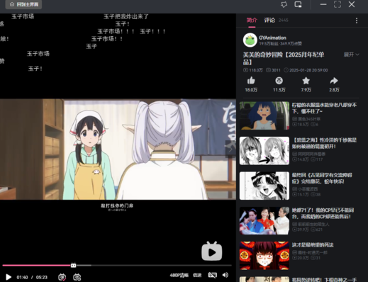
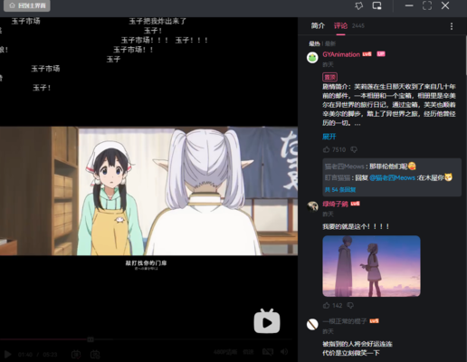
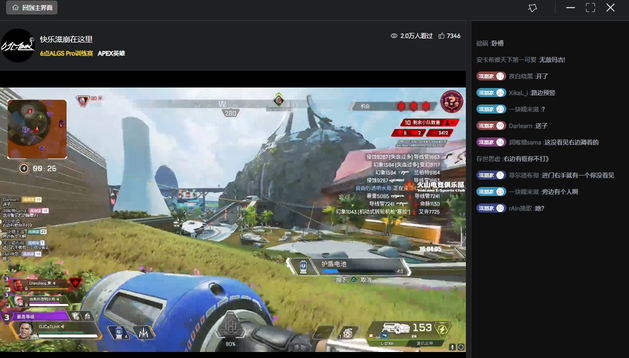

仿b站桌面端App
> **此项目仅个人爱好用于学习和交流，不得用于商业用途**
# 本项目使用Vue3, Electron, TypeScript, Nodejs18开发

# 由于设备限制部分UI仅适配了Windows平台，MacOs及其它平台需在开发环境额外自行配置

# 功能
* 首页推荐视频
* 热门视频
* 搜索 
    1、综合
    2、排行榜
* 视频详情 
    1、视频流播放
    2、评论列表
    3、弹幕滚动
* 直播详情 
    1、直播流播放
    2、弹幕列表

# 技术方面
* vue3、vite
* vuex(用户信息管理)、vue-router
* 自定义directives(图片懒加载、加载动画)
* mse解析dash视频流
* eslint代码风格
* ramda函数式编程
* express(后端服务)

# 初始化
npm install 安装依赖

# 运行
npm install 安装依赖
在app-bilibili目录下执行 npm run dev 客户端
在serve-bilibili目录下执行 npm start 服务器端

# 打包
npm run electron:build 

# 截图
  
  
  

