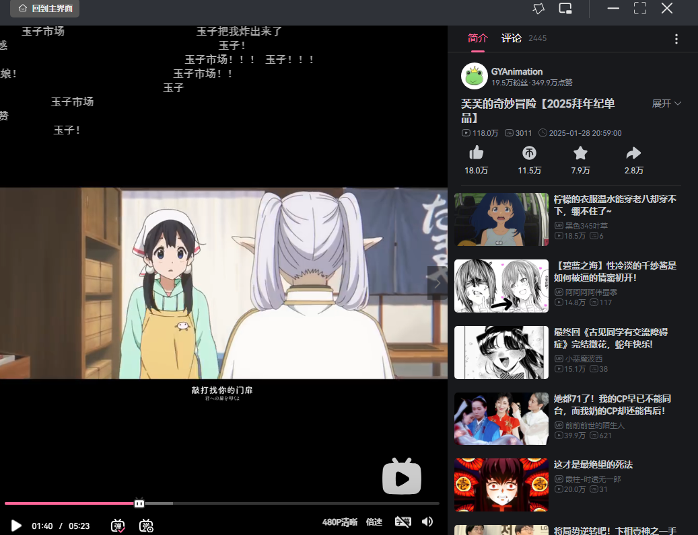
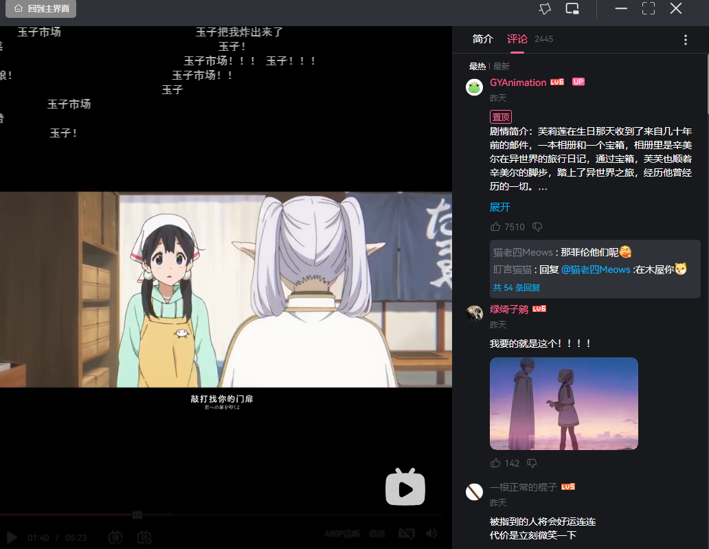

仿b站桌面端App
> **此项目仅个人爱好用于学习和交流，不得用于商业用途**
# 本项目使用Vue3 + Electron开发

# 功能
* 首页推荐视频
* 热门视频
* 视频播放器
* 视频评论列表

# 初始化
npm i 安装依赖

# 运行
客户端执行npm run dev
服务器端执行npm start

# 打包
npm run electron:build 

# 截图
  
  
  
  

部分功能未实现未来会持续更新。